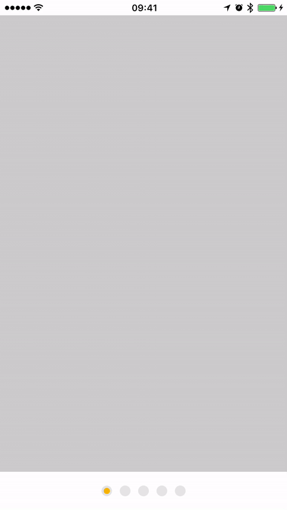

# BSYellowPages
An iOS customizable ScrollIndicator



BSYellowPages is available through [CocoaPods](http://cocoapods.org). To install
it, simply add the following line to your Podfile:

```ruby
pod "BSYellowPages"
```
or install manually by downloading the files from GitHub and then use
```ObjC
#import "BSYellowPages.h"
```

### How to use

## To run the example project, clone the repo, and run `pod install` from the Example directory first.

```objective-c
#import "BSYellowPagesView.h"
...
@property (weak, nonatomic) IBOutlet UIScrollView *scrollView;
@property (weak, nonatomic) IBOutlet BSYellowPagesView *yellowPagesView;
...
[self.yellowPagesView createYellowPagesWithScrollView:self.scrollView];

```

### Customization with IB


## Requirements
  * iOS 8.0 or higher
  * ARC

## Author

iBlacksus, iblacksus@gmail.com

## License

BSYellowPages is available under the MIT license. See the LICENSE file for more info.