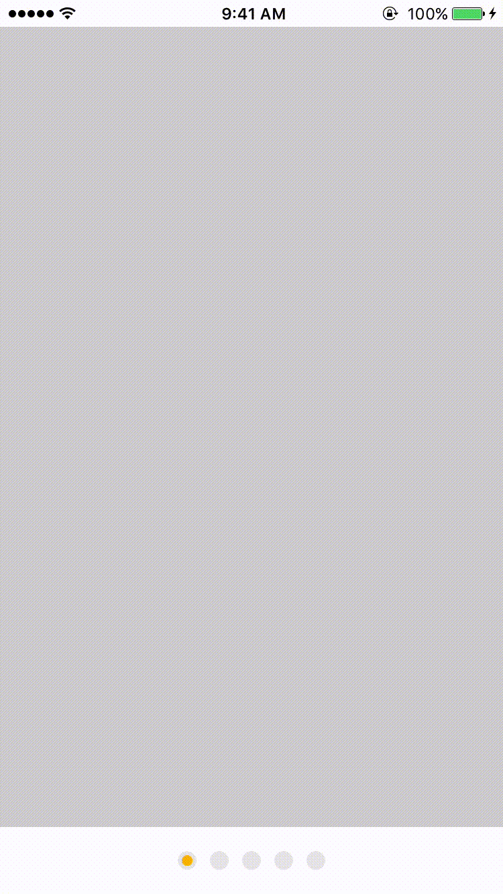
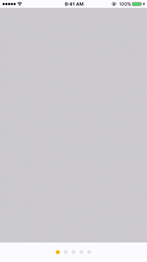
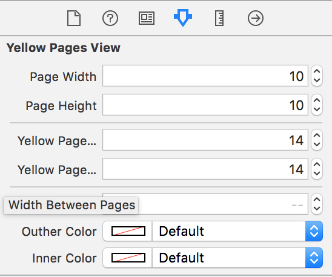
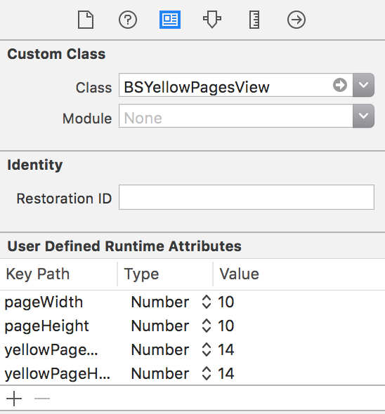

# BSYellowPages
An iOS customizable ScrollIndicator




### How to use
```objective-c
#import "BSYellowPagesView.h"
...
@property (weak, nonatomic) IBOutlet UIScrollView *scrollView;
@property (weak, nonatomic) IBOutlet BSYellowPagesView *yellowPagesView;
...
[self.yellowPagesView createYellowPagesWithScrollView:self.scrollView];

```

### Customization with IB


